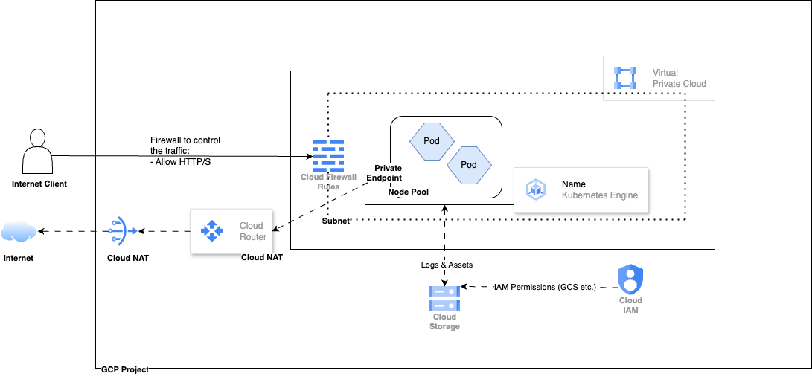

# GCP Scalable Web Application Stack with Terraform

This project provisions a **scalable, production-like web application infrastructure** on Google Cloud Platform using **Terraform**. It features modular architecture, GKE for orchestration, Cloud Storage, VPC networking, IAM controls, and observability via Cloud Logging and Monitoring.

---

## Setup & Deployment

### 1. **Pre-requisites**
- Terraform ≥ 1.10
- GCP Provider ≥ 6.x
- A GCP project (e.g., `recruiting-fulya-g`)
- A service account key with sufficient IAM permissions (as a TFC env var `GOOGLE_CREDENTIALS`)
- Terraform Cloud workspace (or run locally)

### 2. **Clone the Repo**
git clone https://github.com/your-org/gcp-webstack-terraform.git

cd gcp-webstack-terraform

## Architecture Overview
GKE (Google Kubernetes Engine): Hosts the containerized web application

Cloud Storage: Stores static assets or logs; IAM-limited service account access

VPC: Custom network with subnets, firewall rules, and tags

Ingress Controller: Exposes app publicly via HTTP(S) Load Balancer

Security & IAM
IAM roles follow least privilege principle

Dedicated service account per module (Storage etc.)

Explicit firewall rules

Observability
GKE logging via logging.googleapis.com/kubernetes

Metrics via monitoring.googleapis.com/kubernetes

<!-- BEGIN_TF_DOCS -->
## Requirements

| Name | Version |
|------|---------|
|  [terraform](#requirement\_terraform) | >= 1.8.5, < 2.0.0 |
|  [google](#requirement\_google) | >= 6.0 |

## Providers

No providers.

## Modules

| Name | Source | Version |
|------|--------|---------|
|  [gcs](#module\_gcs) | ./modules/gcs | n/a |
|  [gke](#module\_gke) | ./modules/gke | n/a |
|  [k8s](#module\_k8s) | ./k8s | n/a |
|  [vpc](#module\_vpc) | ./modules/vpc | n/a |

## Resources

No resources.

## Inputs

| Name | Description | Type | Default | Required |
|------|-------------|------|---------|:--------:|
|  [project\_id](#input\_project\_id) | The GCP Project  ID | `string` | n/a | yes |
|  [region](#input\_region) | The GCP Region | `string` | n/a | yes |

## Outputs

No outputs.
<!-- END_TF_DOCS -->